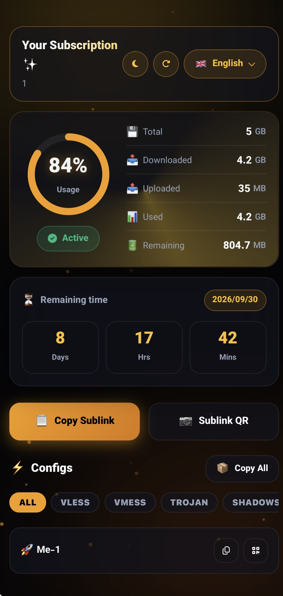
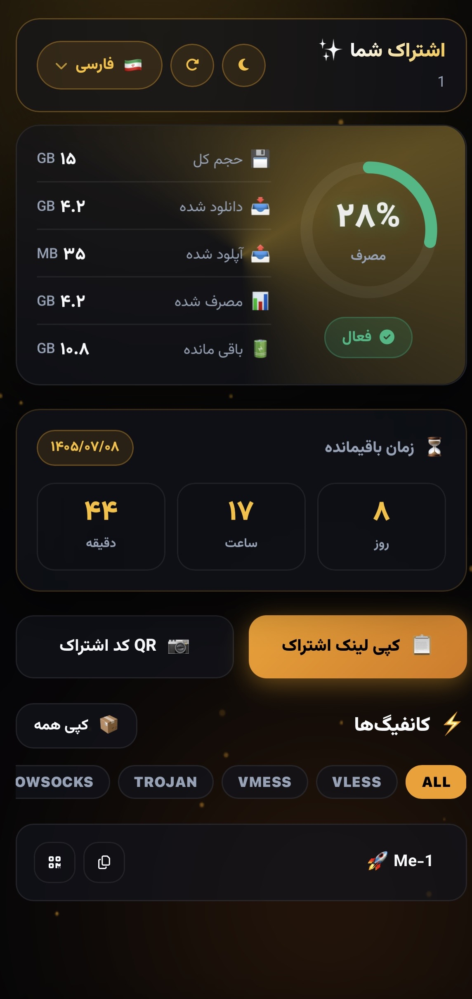
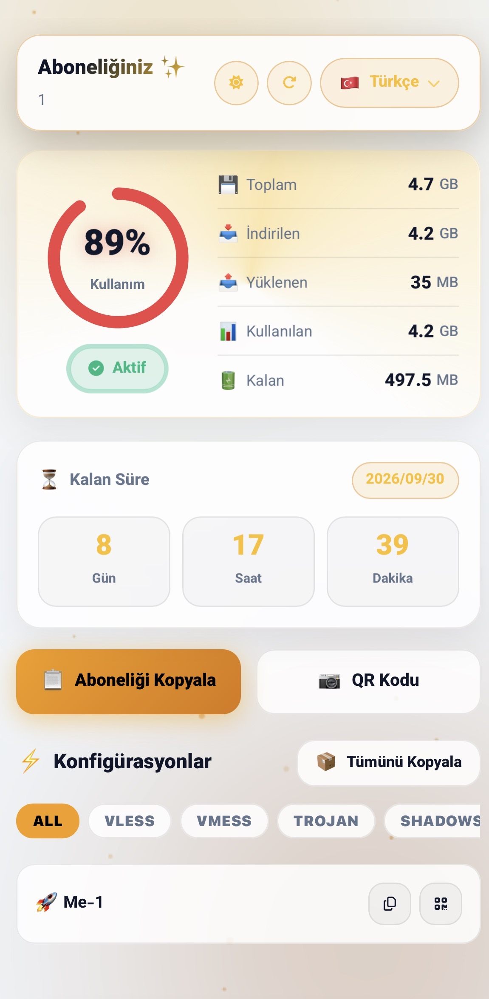

<div align="center">

# ⚡ 3X-UI Custom Subscription Template

**قالب اختصاصی، فوق‌العاده سبک، سریع و واکنش‌گرا برای صفحات اشتراک پنل 3X-UI**

[پیش‌نمایش](#-پیش‌نمایش-تصویری) • [ویژگی‌ها](#-ویژگی‌های-کلیدی) • [نصب سریع](#-نصب-سریع-روی-سرور) • [مسیر نصب](#-مسیر-نصب) • [لایسنس](#-لایسنس)

</div>

---

## 📷 پیش‌نمایش تصویری

<div align="center">
  
  
  <br/><br/>
  
</div>

---

## ✨ ویژگی‌های کلیدی

- 🎨 **پشتیبانی از دو تم تاریک و روشن:** تغییر هوشمند تم (Dark / Light) همراه با ذخیره‌سازی وضعیت در مرورگر کاربر.
- 🌐 **چندزبانه (۵ زبان):** پشتیبانی کامل از زبان‌های فارسی (🇮🇷)، انگلیسی (🇬🇧)، چینی (🇨🇳)، روسی (🇷🇺) و ترکی (🇹🇷) همراه با تغییر جهت خودکار صفحه (RTL/LTR).
- 📊 **نوار دایره‌ای ۳ رنگ هوشمند:** گِیج مصرف پویا با سه رنگ سبز زمردی، نارنجی و قرمز نئونی بر اساس درصد مصرف حجم.
- ⏳ **تایمر معکوس لحظه‌ای:** نمایش دقیق روز، ساعت و دقیقه باقی‌مانده از اعتبار اشتراک.
- 📱 **قابلیت نصب اپلیکیشن (PWA):** امکان افزودن پنل به صفحه اصلی گوشی (Add to Home Screen) در iOS و اندروید.
- ⚡ **جستجو و فیلتر کانفیگ‌ها:** قابلیت جستجوی سریع و فیلتر بر اساس پروتکل‌های VLESS ،VMESS ،Trojan و Shadowsocks.
- 🔐 **کد تمیز و یکپارچه:** ارائه‌شده در قالب یک فایل واحد بدون اسکریپت‌های ردیابی یا کدهای اضافی.

---

## 🚀 نصب سریع روی سرور

برای نصب و فعال‌سازی خودکار قالب روی پنل **3X-UI**، کافیست دستور تک‌خطی زیر را در ترمینال سرور اجرا کنید:

```bash
bash <(curl -Ls [https://raw.githubusercontent.com/acor1/3xui-Tamplate/main/install.sh](https://raw.githubusercontent.com/acor1/3xui-Tamplate/main/install.sh)
